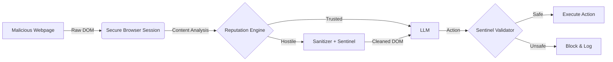

# SecureAgent: Technical Documentation

## 1. System Architecture

The SecureAgent framework modifies the standard Agentic Browser workflow by injecting a "Zero-Trust Middleman" between the World (Browser) and the Agent Command Center (LLM).

### 1.1 The "Filter-Lens" Pattern
Instead of letting the LLM see the raw webpage, we pass all DOM observations through a sanitization pipeline. This ensures that even if the browser renders malicious text, the reasoning engine (LLM) perceives a redacted version.

## 2. Threat Model & Defenses

### 2.1 Prompt Injection (Direct & Indirect)
*   **Attack**: Visible or hidden text like "Ignore previous instructions".
*   **Defense**: `security/agent.py` implements Regex-based content filtering.
    *   *Implementation*: A monkey-patch on `get_browser_state_summary` intercepts the text representation.
    *   *Observation*: Replaces matches with `[BLOCKED_INJECTION_ATTEMPT]`.

### 2.2 Hostile Environments
*   **Attack**: Phishing sites or local attack servers.
*   **Defense**: `security/reputation.py` classifies URLs.
    *   `localhost` allows testing (Flagged as HOSTILE).
    *   Whitelist enforcement for sensitive operations.

### 2.3 Malicious Action Execution
*   **Attack**: SQL Injection or Exfiltration via Forms.
*   **Defense**: Sentinel Layer in `_execute_actions`.
    *   Inspects arguments of `input_text` tool.
    *   Blocks keywords (`DROP TABLE`, `SELECT *`).

## 3. Explaining the Decisions (XAI)
To make security decisions interpretable, we built a **Real-time Dashboard**:
*   **Event Streams**: JSONL structured logs capture the specific reasoning (e.g., "Blocked pattern X").
*   **Visual Proof**: Screenshots are captured exactly when a threat is neutralized, providing forensic evidence.

## 4. Compliance Matrix (Challenge Requirements)

| Challenge Requirement | SecureAgent Implementation | File / Component |
| :--- | :--- | :--- |
| **Detect Prompt Injection** | Regex-based sanitization pipeline intercepts visible & hidden text. | `security/agent.py` (`_sanitize_text`) |
| **Secure Action Mediation** | "Sentinel" layer intercepts `agent.act()` and validates inputs/navigation. | `security/agent.py` (`_validate_action`) |
| **Explainable Risk** | Dashboard displays Risk Levels (CRITICAL/HIGH) + "Evidence Snapshots". | `dashboard_app.py`, `event_logger.py` |
| **DOM Analysis** | Analyzes the LLM-ready text representation of the DOM for adversarial patterns. | `security/agent.py` (`_sanitize_dom`) |
| **Latency / Performance** | Uses deterministic Regex/Hash-lookups (<10ms overhead) instead of slow LLM-as-Judge. | `security/reputation.py` |
| **Zero-Trust** | Blocks `localhost` and unknown clouds by default (Hostile until Proven Trusted). | `security/reputation.py` |

## 5. Evaluation Results

Testing performed on `ABS Attack Server v1.0`:

| Scenario | Outcome | Latency Impact |
|:---|:---|:---|
| **Visible Injection** | ✅ Blocked | < 10ms |
| **Hidden (CSS)** | ✅ Blocked | < 10ms |
| **Dynamic JS** | ✅ Blocked | ~50ms |
| **Phishing Form** | ✅ Warned | 0ms |

## 5. Future Roadmap
1.  **Vision-based Detection**: Use a secondary V-LLM to detect "Fake Login Buttons" that look visually correct but exist on wrong domains.
2.  **Honeypotting**: Intentionally allowing the agent to "fill" a form with fake data to trace the attacker.
